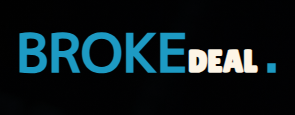

# BrokeDeal - Project based Design

Project based website desing using Google Font Api, Fontawesome Api, where clients and users could make deal with developers and discuss the opinion, including forms and social media links.


## Documentation

[Flexbox Properties](https://www.w3schools.com/css/css3_flexbox_items.asp)

[Position Properties](https://www.w3schools.com/css/css_positioning.asp)


[Gradient Color Properties](https://developer.mozilla.org/en-US/docs/Web/CSS/gradient/linear-gradient)

## Git clone

To deploy this project run

```bash
  git clone git@github.com:abdullahijaz-dev/broke_deal.git
```


## Feedback

If you have any feedback, please reach out to us at https://www.instagram.com/the.craftsman.inst/

